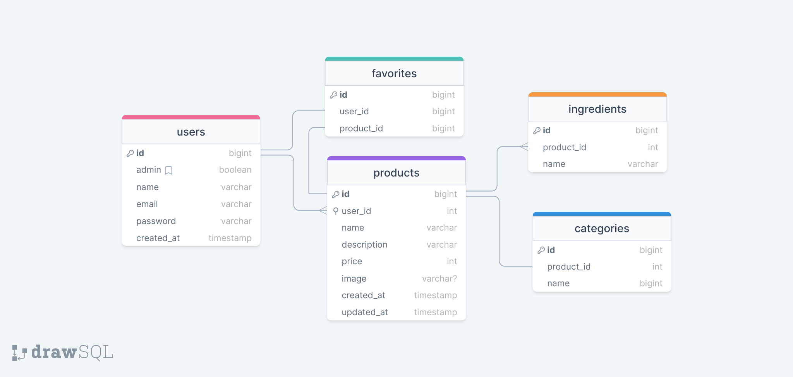

# Food Explorer
Pick the best language for you: 
[](./README.md)
[](./README.pt-br.md)

An API for a restaurant website. The back-end was created with Node.js and JavaScript, integrated with SQLite and managed with Knex.js.

The back-end was created to provide the following features:

* **Create** users.
* **Create, update and delete** products.
* **Upload and delete files** for product images.
* **Manage categories for products** (drink, meal and dessert).
* **Set user's favorite products**.
* Use **JWT Token** to authenticate and create user session.
* Only *admin users can manage* products.

## Installation

Install foodExplorer-backend with npm. To run locally, simple run "npm install" while on the project folder and run it with "npm run dev" or "npm start"

```bash
  ## Enter the project's folder
  cd foodExplorer-backend
  
  ## Install node dependencies
  npm install

  ## Run the API
  npm start

  ## Alternatively, if you want to run with nodemon
  npm run dev
```
    
## Environment Variables

To run this project, you will need to add the following environment variables to your .env file

| Env | Description                |
| :-------- | :------------------------- |
| `AUTH_SECRET` | This will be the secret needed to validate user's tokens with jsonwebtoken. If you don't set any value, the project will run with *'default'* value instead.|
| `PORT` | This sets the port that your server is going to be running. If not set, the default port is `3333`


## Database

To achieve the goals of the project, it was built a database with the following diagram:




## API Reference
If you want a shortcut, the settings for every HTTP request are available on the file `insomnia_settings.json`, so you can let Insomnia do the job.

#### Get all products

```http
  GET /api/products
```

#### Get product

```http
  GET /api/product/${id}
```

| Parameter | Type     | Description                       |
| :-------- | :------- | :-------------------------------- |
| `id`      | `string` | **Required**. Id of item to fetch |

#### Search products

```http
  GET /api/product?search=${anything}
```

|   Query   | Type     | Description                       |
| :-------- | :------- | :-------------------------------- |
| `search`  | `string` |  Search for ingredients and product names |

#### Create product
Expects an JSON with the data that should be created.

```http
  POST /api/product
```
|   Property   | Type               | Description                       |
| :--------    | :------------------| :-------------------------------- |
| `title`      | `string`           |  Name of the product |
| `description`| `string`           | Description of the product |
| `price`      | `number`           | Price of the product |
| `ingredients`| `array of strings` | Each ingredient of the product |
| `category`   | `string`           | Category of product (meal, drink, dessert, etc) |
| `image`      | `string`           | Sets the location of the file uploaded on creation of the product. |


#### Update product

Works in the same way of create product, but with a PUT request.

```http
  PUT /api/product/${id}
```

| Parameter | Type     | Description                       |
| :-------- | :------- | :-------------------------------- |
| `id`      | `string` | **Required**. Id of item to fetch |


## Tech Stack

**Client:** React, Vite, Styled Components, HeadlessUI.

**Server:** Node, Express, Knex, jsonwebtoken, Jest, Multer, dotenv.

